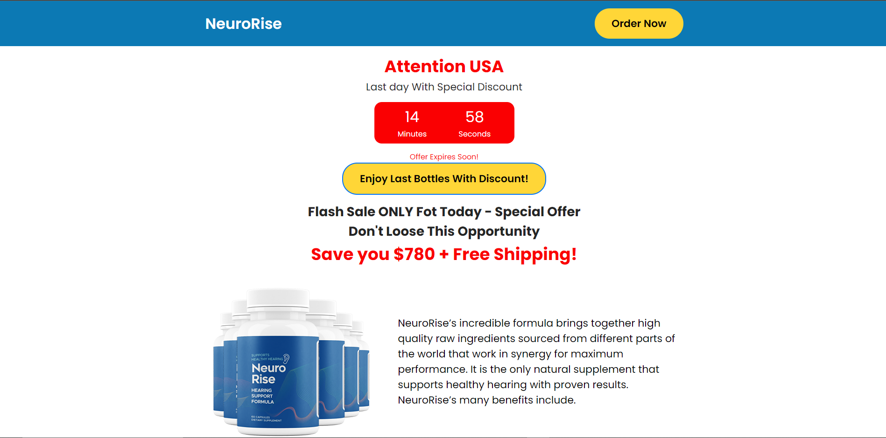

# About

<h2> Um protejo simples de uma pagina de pré-venda</h2>

# Desktop

<p align="center">
    
  
</p>

# Mobile

<p align="center">
  
</p>

## 🧪 Technologies

Este Projeto foi desenvolvido usando seguintes tecnolias:

HTLM
CSS
JavaScript

## 🚀 Getting started

Clone o projeto pare ter acessos dos arquivos.

```bash
git clone https://github.com/JoeSeraphy/presell-neurorise.git

cd portfolio
```

## 📝 License

This project is licensed under the MIT License. See the [LICENSE](LICENSE) file for details.

---

Made with 💜 by [JoeSeraphy]
